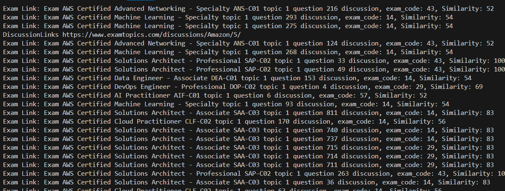

# examtopics-webscraper

## Summary
A simple web app with the main purpose of Scraping data from the Website ExamTopics
From there collect the scraped data and use it to test yourself 

### Main Issue 
Issue is that to look at all the questions you need to have the subscription
but you can look at any question if you search up the exam name along with the question number 


### Solution?
Create a script to go through the different pages and just collect the data necessary as shown below in `Data Section`


# How to use
#### Automatic Scraping
1) Run `py app.py` to run the backend server 
2) Run `npm run dev`, which runs the website server, from here go to Web Scraper 
3) navigate to `Scrape Page`
4) Choose a Provider and an Exam (You will not be able to proceed with scraping without these two data)
5) Click `Scrape!` 
6) Stop the program whenever you feel you have collected enough questions


#### Manual Scraping (If Automatic Scraping is not working)
- Step 1
1) Run `npm run dev`, which runs the website server, from here go to Web Scraper 
2) navigate to `Scrape Page`
3) Choose a Provider and an Exam (You will not be able to proceed with scraping without these two data)
4) Click `Scrape!` 
5) Inspect element of the website, the latest Console Log will include all of the details the backend needs to proceed with scraping

- Step 2
1) In the code of app.py above the `main()` function is a placeholder to paste the details object assigning it to scrape_details
2) Run `py main.py` to run the backend server
3) Watch the magic hapen! 
4) Stop the program whenever you feel you have collected enough questions


#### Data Section
Example Exams
- /exams/amazon/aws-certified-developer-associate-dva-c02

Questions will be written in format below
```
[
    {
        "exam_name" : ""
        "questionNo": "",
        "topic": "",
        "question": "",
        "choices": [
            "",
            "",
            "",
            "",
            ""
        ],
        "answer": "",
        "comments": [
            {
                "user": "",
                "selected": "",
                "comment": "",
                "comments": []
            }
        ]
    }
]
```


#### IN progress
After every round, the runs are saved into /dumps/runs
this is to keep track of details such as
- How many successful scrape
- How many of those successful scrape resulted in a question
- How many other questions/exam/etc were encountered
- How many error pages encountered
- How long did the program run for

in the form of
```
{
    program_start_date: '',
    program_end_date: '',
    duration: '',
    total_bans: '',
    longest_delay: '',
    scrape_data: {
        total_successful_scrape: '',
        total_questions: '',
        total_unused_questions: '',
        total_error_pages
    }
}
```


#### How it the script works
##### 1.
- Goes to the page `https://www.examtopics.com/discussions/[provider]/[pageNum]/`
- From the Scrape Section within the webApp, the user chooses a provider and the selected exam which consists of the exam-code and exam-name
- Here it is substituted to eg. `https://www.examtopics.com/discussions/amazon/1/` 

##### 2.
- This page consists of a list of exam questions by the provider, and the most recent created discussion will be at the top
- The script scapes this page and collects the title and link to the discussion, it then uses a fuzzysearch algorithm to match the similarity of the title with the exam-code and exam-name that you selected
- as shown below


##### 3. 
- Any similarity matches over 80 will be considered a hit and the script will fetch from the link and scrape that site for the questions in the format shown in `Data Section`
- Afterwards the pageNum of discussion will be incremented to repeat from step 2


### For Contributors
To run the python server, create first the python virtual environment, by `virtual venv` then install from requirements.txt `pip install -r 'requirements.txt'` then run `venv\Scripts\python server.py`

To run the python scripts run `py main.py`, make sure you are in your virtual environment with  `

If you added more python libraries be sure the libraries are added to requirements, `pip freeze > requirements.txt` this command automatically adds from your venv
